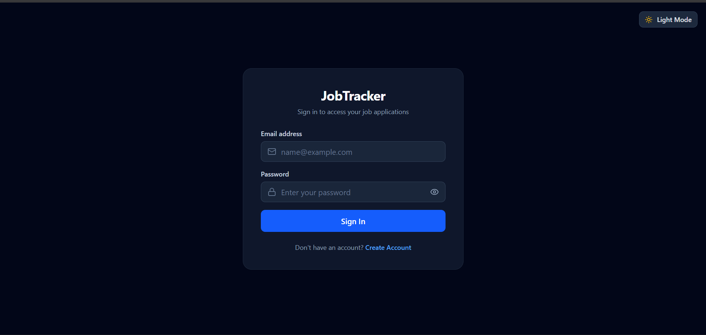
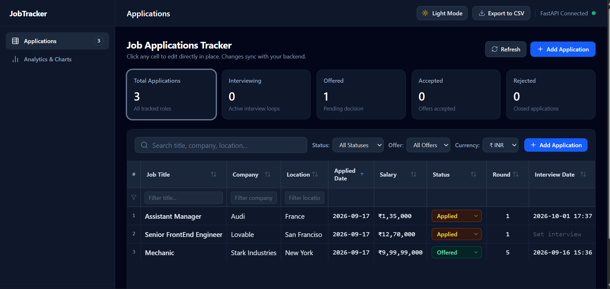
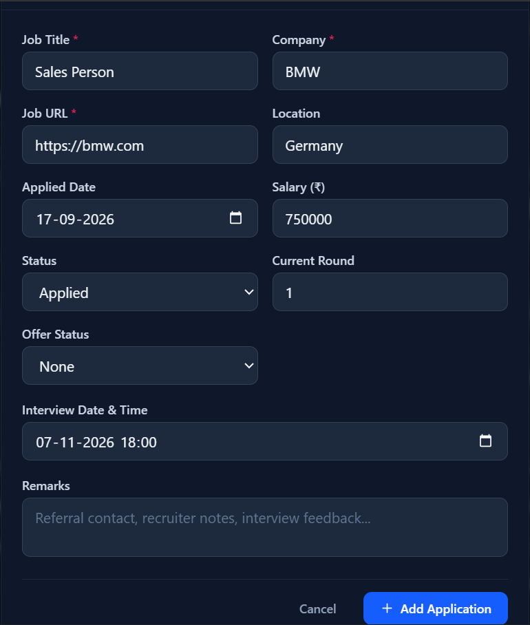
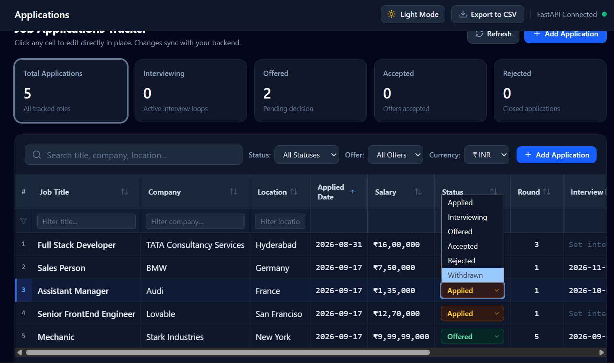

# Job Application Tracker

A full-stack web application for managing and tracking job applications in one place.

The application allows users to create an account, securely log in, and manage their job applications throughout the hiring process. Users can track application details such as company, role, location, salary, application status, interview information, offer status, and personal remarks.

## Features

### User Authentication
- User registration with email validation
- Secure password hashing
- JWT-based authentication
- Protected API endpoints
- User-specific data access and authorization

### Job Application Management
- Create job applications
- View individual applications
- View all applications
- Update application details
- Delete applications
- Filter applications by status
- Pagination using limit and offset
- Applications ordered by most recently created

### Application Tracking

Each job application can store information including:

- Job title
- Company name
- Job URL
- Location
- Application date
- Salary
- Application status
- Current interview round
- Interview date
- Offer status
- Remarks

### Security
- JWT bearer authentication
- Password hashing
- Protected user and job endpoints
- Ownership checks to prevent users from accessing other users' applications

### Testing & CI
- Automated backend tests using Pytest
- PostgreSQL service used during CI
- Database migrations executed with Alembic
- GitHub Actions workflow for automated testing

## Tech Stack

### Frontend
- React
- TypeScript
- Vite
- CSS

### Backend
- Python
- FastAPI
- SQLAlchemy
- Pydantic
- PyJWT
- pwdlib

### Database
- PostgreSQL
- Alembic for database migrations

### Testing & CI
- Pytest
- GitHub Actions

### Containerization & Deployment
- Docker
- Docker Compose
- Render

## Architecture

The application follows a client-server architecture:

                         ┌─────────────────────┐
                         │       React         │
                         │    TypeScript UI    │
                         └──────────┬──────────┘
                                    │
                              HTTP / REST API
                                    │
                                    ▼
                         ┌─────────────────────┐
                         │      FastAPI        │
                         │      Backend        │
                         └──────────┬──────────┘
                                    │
                   ┌────────────────┼────────────────┐
                   │                │                │
                   ▼                ▼                ▼
             ┌───────────┐   ┌────────────┐   ┌─────────────┐
             │    JWT    │   │ SQLAlchemy │   │   Pydantic  │
             │   Auth    │   │    ORM     │   │   Schemas   │
             └───────────┘   └─────┬──────┘   └─────────────┘
                                   │
                                   ▼
                           ┌─────────────────┐
                           │   PostgreSQL    │
                           │    Database     │
                           └─────────────────┘
                                   ▲
                                   │
                           ┌─────────────────┐
                           │     Alembic     │
                           │    Migrations   │
                           └─────────────────┘

## Project Structure

```text
Job Application Tracker/
├── .github/
│   └── workflows/
│       └── ci.yml
├── backend/
│   ├── app/
│   │   ├── auth/
│   │   │   └── oauth2.py
│   │   ├── routers/
│   │   │   ├── auth.py
│   │   │   ├── jobs.py
│   │   │   └── user.py
│   │   ├── config.py
│   │   ├── database.py
│   │   ├── main.py
│   │   ├── models.py
│   │   ├── schemas.py
│   │   └── security.py
│   ├── alembic/
│   │   └── versions/
│   ├── tests/
│   │   ├── test_auth.py
│   │   ├── test_jobs.py
│   │   └── test_users.py
│   ├── Dockerfile
│   ├── alembic.ini
│   ├── requirements.txt
│   └── start.sh
├── frontend/
│   ├── src/
│   ├── Dockerfile
│   ├── package.json
│   ├── vite.config.ts
│   └── index.html
├── docker-compose.yml
└── .gitignore
```

## Authentication & Security

The application uses JWT (JSON Web Token) based authentication to protect user-specific resources.

### Authentication Flow

```text
User
 │
 │  Email + Password
 ▼
POST /login
 │
 │  Verify credentials
 ▼
FastAPI
 │
 │  Generate JWT
 ▼
Access Token
 │
 │  Bearer Token
 ▼
Protected Endpoints
 │
 ▼
get_current_user()
 │
 │  Decode & validate token
 ▼
Authenticated User
```

## Database & Migrations

The application uses PostgreSQL as its relational database and SQLAlchemy as the ORM for database operations.

### Database

The main database entities are:

- **Users** — stores user account information and securely hashed passwords.
- **Job Applications** — stores job application details and associates each application with its owner.

Each job application is linked to a user through a foreign key, allowing the application to enforce user-specific data access.

### SQLAlchemy

SQLAlchemy is used to:

- Define database models
- Establish relationships between entities
- Execute database queries
- Create, update, and delete records
- Manage database sessions

### Alembic

Alembic is used to manage database schema migrations.

Database changes are tracked through versioned migration files rather than manually modifying the database schema.

The backend container automatically runs pending migrations when it starts:


python -m alembic upgrade head

## Docker

The application is containerized using Docker and Docker Compose.

The local development environment consists of three services:

- **Frontend** — React + Vite
- **Backend** — FastAPI
- **Database** — PostgreSQL

Docker Compose connects these services so they can communicate within the same Docker network.

### Run with Docker Compose

Clone the repository:


git clone https://github.com/50001-SatyaKrishna/job-application-tracker.git
cd job-application-tracker

## Testing

The backend includes automated tests using Pytest.

The test suite covers:

- User registration
- User authentication
- Protected endpoints
- Job application creation
- Job application retrieval
- Job application updates
- Job application deletion
- Authorization and ownership checks

Run the tests locally from the `backend` directory:


pytest

## Deployment

The application is deployed using Render.

The production environment consists of:

- React frontend
- FastAPI backend
- PostgreSQL database

The backend and frontend are deployed as separate services, while the PostgreSQL database is hosted using Render PostgreSQL.

### Production Configuration

The backend uses environment variables for:

- PostgreSQL connection details
- SQLAlchemy database URL
- JWT secret key
- JWT algorithm
- Access token expiration

The frontend is configured with the deployed backend URL through the `VITE_API_URL` environment variable.

### Database Migrations

Alembic migrations are applied to the production PostgreSQL database to keep the database schema synchronized with the application's models.

### CI/CD

GitHub Actions provides continuous integration by automatically running the backend test suite and database migrations.

Render handles the deployment of the application services from the repository.

## Live Demo

The application is deployed and available online.

- **Frontend:** https://job-application-tracker-frontend-mc98.onrender.com
- **Backend API:** https://job-application-tracker-92vv.onrender.com
- **API Documentation:** https://job-application-tracker-92vv.onrender.com/docs

> The backend may take some time to respond if the Render service has been idle.

## Screenshots

### Login




### Job Dashboard




### Add Job Application




### Edit Job Application

